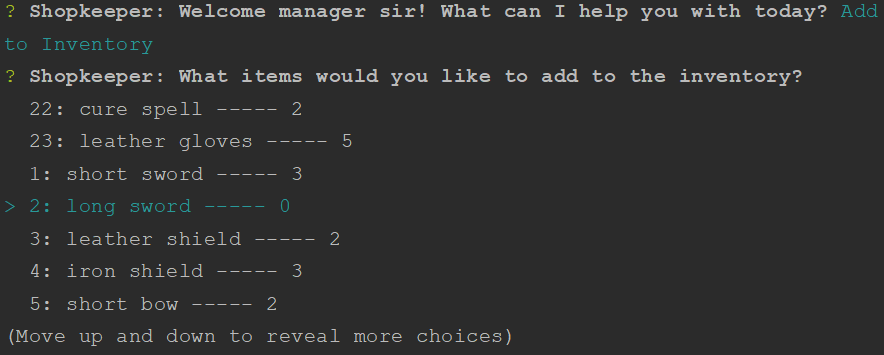

# BAMAZON
### Alexander Gonzalez

BAMAZON is an Amazon-like storefront that uses MySQL and Node. With bamazonCustomer.js, the app takes in orders from customers and depletes stock from the store's inventory. With bamazonManager.js, the app gives various options only available to a manager such as checking low inventory and adding products (among other options).

## How to Use BAMAZON

Use 'node bamazonCustomer.js' to run the customer application.

Select an item to purchase, using the arrow keys to scroll up and down. The database is updated after a purchase is completed.

If the stock_quantity of an item is 0, the user will be told the item is out of stock.

====================================================================

Use 'node bamazonManager.js' to run the manager application.

Selecting 'View Product for Sale' shows the manager all products that have at least one in stock.

Selecting 'View Low Inventory' shows products that have less than five in stock.

Selecting 'Add to Inventory' will ask the manager which item to add more of. The manager will then be asked how many to increase the quantity by and then update the database with the stock_quantity for that item.

Selecting 'Add New Product' will ask the user a series of questions about the product before adding it to the database. 

Finally, when the manager is done...

